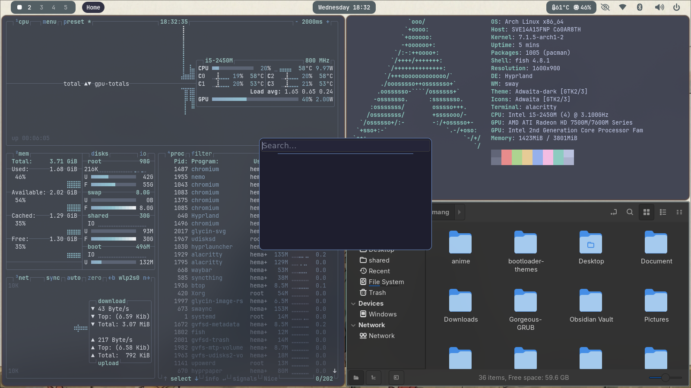

# 🪟 myArchy — Arch Linux + Hyprland

A minimal, cozy, and highly functional Arch Linux configuration featuring a warm anime/Ghibli-inspired aesthetic, a custom top status bar, and optimized workspace management.

## 📸 Preview

[](preview/preview.png) [](preview/preview1.png)

*Clean top bar, active workspace indicators, and system resource monitors.*

## ✨ Features

- **Minimalist aesthetic:** soft, warm color palette with clean typography.
- **Custom status bar:** workspace switcher and window title on the left, battery / screenshot / clock in the center, system telemetry and quick TUIs (Wi-Fi, Bluetooth, audio) on the right.
- **Dynamic workspaces:** 10 workspaces, floating utility windows, window grouping.
- **Idle management:** dim, lock, screen-off and suspend via hypridle + hyprlock.

## 🛠️ Stack

| Part | Choice |
| --- | --- |
| OS | Arch Linux |
| Compositor | Hyprland (hypridle, hyprlock, hyprpaper, hyprlauncher) |
| Bar | Waybar |
| Notifications | SwayNC |
| Terminal / shell / editor | Alacritty / fish / Neovim |
| Display manager | SDDM |

## 🚀 Installation

On an Arch install that already has a normal user with `sudo` and internet access:

```bash
sudo pacman -S --needed git
git clone https://github.com/Hemang-codes/myArchy ~/myArchy
cd ~/myArchy
bash install.sh
```

The script installs the packages in `packages.txt` (pacman) and `aur_packages.txt` (yay), copies wallpapers to `~/Pictures/wallpaper/`, symlinks each config folder into `~/.config` (existing folders are backed up as `*.bak.<timestamp>`), enables SDDM / NetworkManager / Bluetooth, and sets fish as your shell.

> The configs are **symlinks into this repo**, so keep the repo where you cloned it.

**After your first Hyprland login**, install the `hyprbars` plugin once:

```bash
hyprpm update
hyprpm add https://github.com/hyprwm/hyprland-plugins
hyprpm enable hyprbars
```

## ⌨️ Keybindings (quick reference)

| Action | Keybinding |
| --- | --- |
| Terminal | `SUPER` + `Return` |
| App launcher | `SUPER` + `Space` |
| Close window | `SUPER` + `W` |
| Power menu | `SUPER` + `SHIFT` + `W` |
| File manager / browser | `SUPER` + `E` / `SUPER` + `B` |
| Switch workspace (1–9, 0 = 10) | `SUPER` + `1…0` |
| Move window to workspace | `SUPER` + `SHIFT` + `1…0` |
| Screenshot: window / output / region → clipboard | `SUPER` + `S` / `SHIFT` + `S` / `CTRL` + `S` |
| btop / audio (wiremix) | `SUPER` + `Q` / `SUPER` + `C` |
| Wi-Fi / Bluetooth / notifications | `SUPER` + `N` / `SHIFT` + `B` / `SHIFT` + `N` |
| External monitor input (ddcutil) | `SUPER` + `F9` / `SHIFT` + `F9` |

## 🖥️ Machine-specific settings

These match the author's laptop and will need adjusting elsewhere:

- `hypr/monitor.conf` — output names and resolutions (a catch-all rule handles unknown displays)
- `waybar/config.jsonc` — `thermal-zone`, battery `BAT0` / adapter `ADP1`
- `hypr/bind.conf` — `ddcutil --bus 3`
- `bin/` (optional) — helper scripts such as `media-control` used by the volume/brightness keys; `install.sh` links everything in `bin/` into `~/.local/bin`
